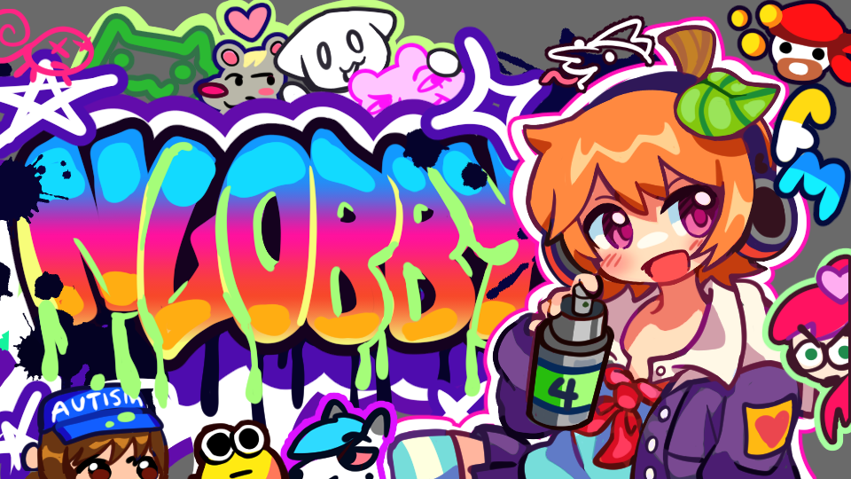
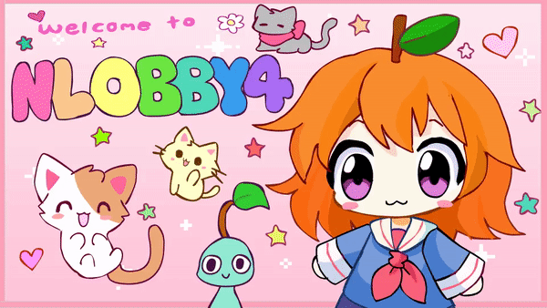
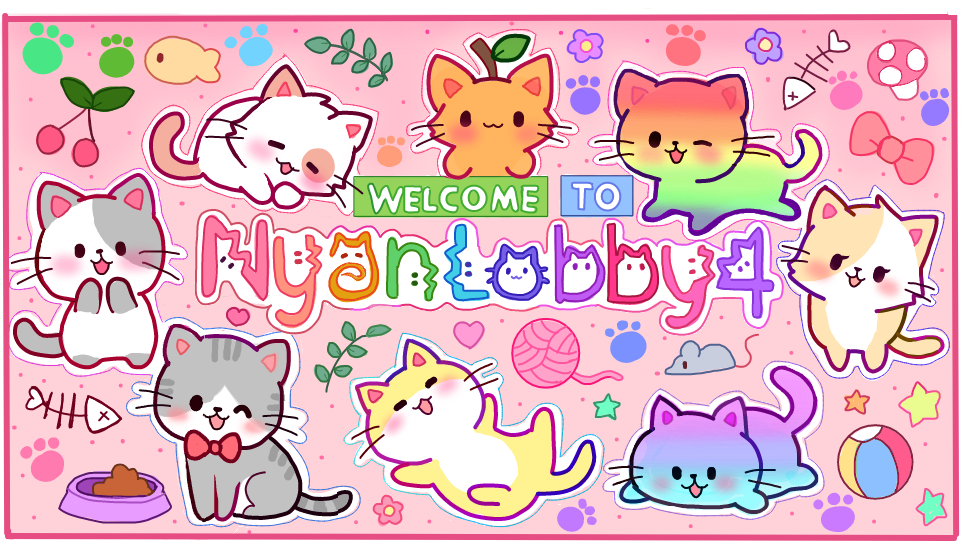
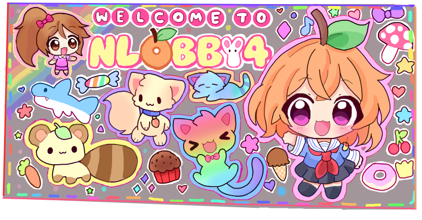
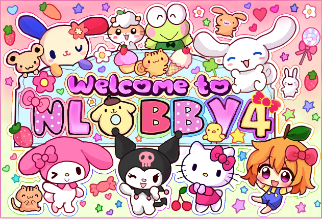
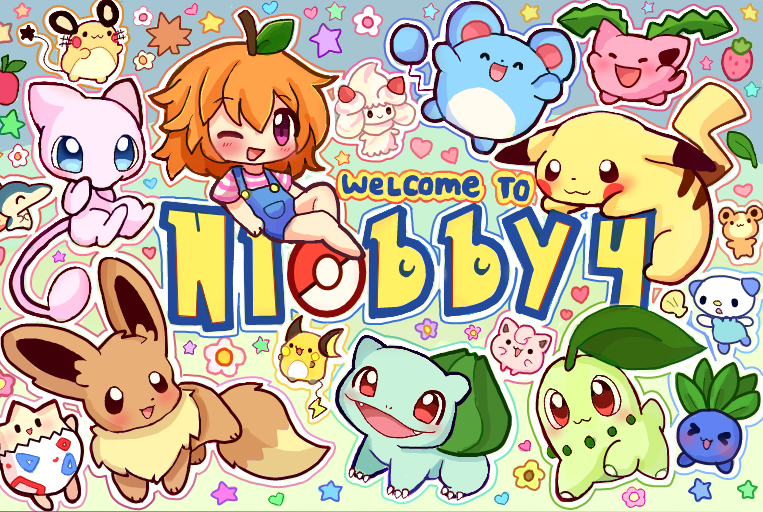
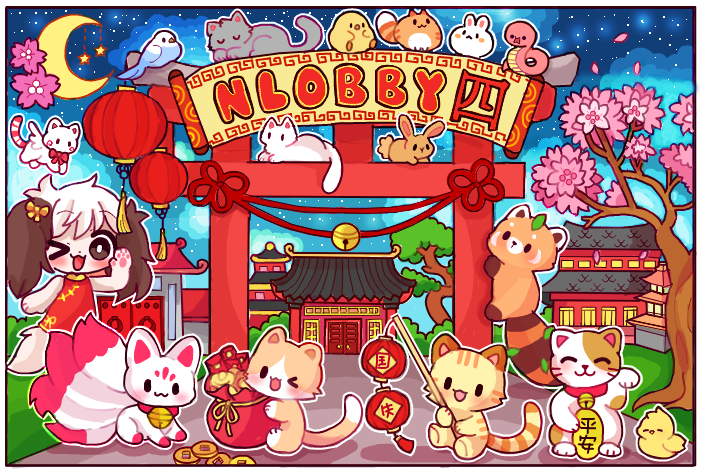

<!-- ############################################# -->
<!-- Links -->

<!-- 
  Shields: https://shields.io/
  UTF8 Art: http://aa.en.utf8art.com/
  ASCII Art: https://www.asciiart.eu/
  ASCII Banners: https://patorjk.com/software/taag/
  Unicode Characters: https://www.amp-what.com/
  Braille Art: https://emojicombos.com/
  Spaces: https://jkorpela.fi/chars/spaces.html
  Color for SVG artworks: #6C757D / #F8F9FA
-- >

<!-- ############################################# -->
<!-- Header -->

<h1 align="center">
  
  
</h1>

  

    == Freedom of art & speech ==  
    If you are a long term member of the flockmod community and would like to contribute to it, please get in touch with any active developer. We are always looking for new contributors and will review you as a potential candidate.
     
     
    ⓘ <a href="https://flockmod.com/news/">​[ɴᴇᴡs]​</a> 
    🖿 <a href="https://flockmod.com/r/nlobby4">​[ᴅʀᴀᴡ]​</a>
     ★ <a href="https://discord.gg/flockmod">​[ᴅɪsᴄᴏʀᴅ]​</a>
  

---

<!-- ############################################# -->
<!-- Main Area -->

  
  
  
  

  
  
  

<!-- ############################################# -->
<!-- References -->
